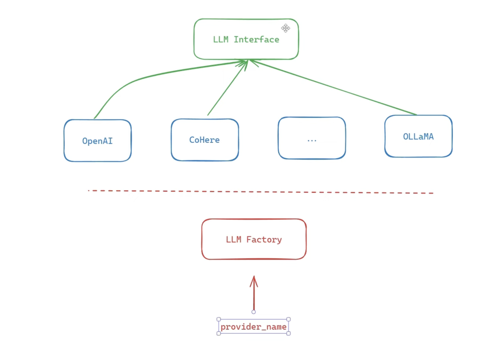

# mini-rag

This is a minimal implementation of the RAG model for question answering.

## Requirements

- Python 3.8 or later

### Install Python using MiniConda

1) Download and install MiniConda from [here](https://docs.anaconda.com/free/miniconda/#quick-command-line-install)
2) Create a new environment using the following command:

```bash
conda create -n mini-rag python=3.8
```

3) Activate the environment:

```bash
conda activate mini-rag
```

### (Optional) Setup you command line interface for better readability

```bash
export PS1="\[\033[01;32m\]\u@\h:\w\n\[\033[00m\]\$ "
```

## Installation

### Install the required packages

```bash
pip install -r requirements.txt
```

### Setup the environment variables

```bash
cp .env.example .env
```

Set your environment variables in the `.env` file. Like `OPENAI_API_KEY` value.

## Run the FastAPI server

```bash
uvicorn main:app --reload --host 0.0.0.0 --port 5000
```

## Reset docker on devs

### stop all the running containers

```bash
sudo docker stop $(sudo docker ps -aq)
```

### remove all the running containers

```bash
sudo docker rm $(sudo docker ps -aq)
```

### remove all the images I downloaded from dockerhub

```bash
sudo docker rmi $(sudo docker images -q)
```

### remove all the volumes

```bash
sudo docker volume rm $(sudo docker volume ls -q)
```

### remove what left

```bash
sudo docker system prune --all
```

### reset all

```bash
sudo docker stop $(sudo docker ps -aq); sudo docker rm $(sudo docker ps -aq); sudo docker rmi $(sudo docker images -q); sudo docker volume rm $(sudo docker volume ls -q); sudo docker system prune --all
```

## Steps to Add a New Table

Follow these steps to properly add a new table to the project:

1. **Create the Schema**  
   - Go to `models/db_schema` and define a new schema for the table.  
   - Include all the table specifications and constraints.

2. **Add an Enum**  
   - In `models/enums/db_enums`, create an Enum for the new table.  
   - This helps maintain consistency for table references throughout the project.

3. **Create the Table Model**  
   - Under `models`, create a model for the table using the schema defined in step 1.  

4. **Update Routes**  
   - Either create a new route or use an existing one.  
   - Add the necessary endpoint logic for CRUD operations on the new table.

<!-- markdownlint-disable MD033 -->

## LLM Factory

<p align="center">
  
</p>

<!-- markdownlint-enable MD033 -->

## Vector DB | QDRANT
